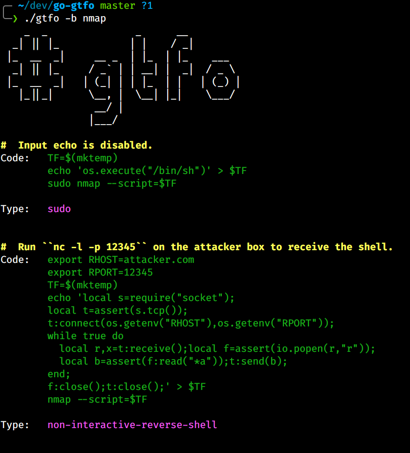
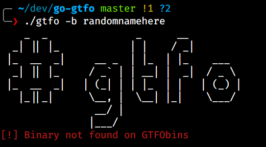

[](https://www.gnu.org/licenses/gpl-3.0)

## GTFO

Reimplementation of my tool [gtfo](https://github.com/mzfr/gtfo) in Go.

I'm mostly doing this as a means of learning Go as it seemed like a nice first project to start with. Also it's much easier to make binaries from Go scripts.

## Gallery

* `gtfo -b nmap`



* `gtfo -b randomnamehere`



## Usage

I decided to keep this plain and simple so there is only 1 option now, to search the gtfobins. I haven't implemented lolbas searching functionality because I never used that in the python verion of gtfo and I thought that might just be waste of time. So if you would like to have that supported please open an issue.

```
Search gtfobin from terminal

Options:
  -b, --bin <binary>       Search Linux binaries on gtfobins
```

## Installation

You can download the pre-compiled binary from [here]()

If you want to make changes to the code and then compile the binary you can clone this repo and then run:

```
go build
```

Also you can run following command to install it directly:

```
go get github.com/mzfr/go-gtfo
```


